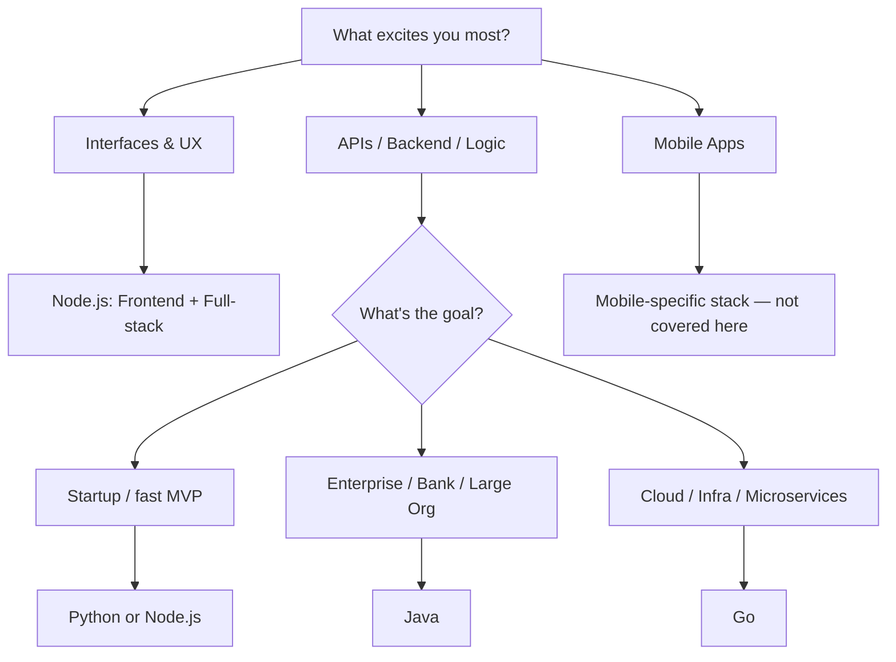

# Choosing Your First Programming Language

> **Phase 0 — The Decision**
> A reference guide for developers picking their first language based on interest, goals, market demand, and ecosystem strength.

|                  |                                                                     |
| ---------------- | ------------------------------------------------------------------- |
| **Version**      | 2.0                                                                 |
| **Last updated** | July 11, 2026                                                       |
| **Maintainer**   | _[add name / team]_                                                 |
| **Scope**        | Python · Node.js · Java · Go                                        |
| **Status**       | Living document — market data should be re-checked every 2–3 months |

---

## TL;DR

| If you want...                                                 | Learn...    | Why                                                                                                                                        |
| -------------------------------------------------------------- | ----------- | ------------------------------------------------------------------------------------------------------------------------------------------ |
| The fastest path into AI/data work, or the broadest job market | **Python**  | #1 on the TIOBE Index (22.61%, Jan 2026) and used by 57.9% of developers surveyed (Stack Overflow 2025) — but junior roles are competitive |
| To ship full-stack products fast at a startup                  | **Node.js** | One language, frontend and backend; dominant in SaaS and real-time apps                                                                    |
| Long-term stability and enterprise pay                         | **Java**    | Runs core systems at ~90% of Fortune 500 companies; slower to break into as a junior, very safe once in                                    |
| Cloud infrastructure and platform engineering                  | **Go**      | Powers Kubernetes, Docker, Terraform; smaller job pool but strong pay and low competition                                                  |

If none of these obviously fits, read the framework below — five minutes now saves months of second-guessing later.

---

## Table of Contents

- [Choosing Your First Programming Language](#choosing-your-first-programming-language)
  - [TL;DR](#tldr)
  - [Table of Contents](#table-of-contents)
  - [Philosophy](#philosophy)
  - [The 4-Step Decision Framework](#the-4-step-decision-framework)
    - [1. Interest Check](#1-interest-check)
    - [2. Goal Check](#2-goal-check)
    - [3. City Scan](#3-city-scan)
    - [4. Ecosystem Match](#4-ecosystem-match)
  - [Decision Flow Diagram](#decision-flow-diagram)
  - [Language Deep Dives](#language-deep-dives)
    - [Python](#python)
    - [Node.js](#nodejs)
    - [Java](#java)
    - [Go](#go)
  - [Comparison Matrix](#comparison-matrix)
  - [Python vs. Node.js: The Common Fork](#python-vs-nodejs-the-common-fork)
  - [Recommendation by Goal](#recommendation-by-goal)
  - [Final Advice](#final-advice)
  - [Suggested Learning Path](#suggested-learning-path)
  - [Sources](#sources)

---

## Philosophy

Choosing your first programming language isn't about picking the "best" language in the abstract — there is no such thing. It's about picking the language that fits **your interests, your goals, your market, and the kind of systems you want to build**.

A strong developer doesn't chase hype blindly. They choose a language with intention.

---

## The 4-Step Decision Framework

### 1. Interest Check

Start with the area that excites you most.

| If you like...                              | Start with...      |
| ------------------------------------------- | ------------------ |
| Building interfaces and user experiences    | Frontend           |
| APIs, databases, logic, and backend systems | Backend            |
| Building mobile apps                        | Mobile development |

The best first language is usually the one that keeps you curious and motivated enough to keep learning.

### 2. Goal Check

Your career target should shape your language choice.

- **Startups** usually value speed, flexibility, and rapid delivery. _Example: an early-stage SaaS product shipping a new feature every week reaches for **Node.js** (one language across frontend and backend) or **Go** (fast to build, cheap to run, easy to scale later) rather than a heavier enterprise stack._
- **Enterprises, banks, and large organizations** often value stability, maintainability, and long-term support. _Example: a bank's core transaction-processing system, or an insurer's decades-old claims platform, runs on **Java** — code that has to keep working reliably for 10+ years matters more than how fast it was to write._
- **Big tech companies** often look for languages that scale well across large systems and teams. _Example: **Python** underpins AI/ML infrastructure (training pipelines, data platforms), **Java** still runs large chunks of backend services at companies like Google and Amazon, and **Go** powers the cloud-native tooling (Kubernetes, internal platforms) that large engineering orgs build on._

### 3. City Scan

Look at what is actually in demand in your city, region, or target market.

- Check LinkedIn job posts.
- Search local hiring trends.
- Compare not just _how many_ jobs exist, but the _quality and consistency_ of those roles.

A language can be technically strong and still be a poor first choice if your local market doesn't reward it.

### 4. Ecosystem Match

Choose a language with strong community support and good tooling. A healthy ecosystem means:

- Strong documentation
- An active community for help
- Many frameworks and libraries
- Good tutorials and courses
- Long-term industry support

This matters because learning speed depends heavily on how easy it is to find examples, answers, and tools.

---

## Decision Flow Diagram

> Renders as a visual flowchart on GitHub, GitLab, Notion, Docusaurus, and most modern doc tools. On plain-text viewers it will display as a fenced code block — the logic still reads fine top to bottom.



---

## Language Deep Dives

### Python

**What it's good at**
Python is one of the easiest languages to learn and one of the most versatile. It's widely used in:

- Data science
- Machine learning
- AI and automation
- Scripting and DevOps tasks
- Backend APIs
- Rapid prototyping

**Technical and architectural view**
Python favors speed of development and readability over raw runtime performance. It's not usually the first choice for ultra-low-latency systems, but it excels wherever developer productivity matters most. In architecture, Python commonly powers:

- REST APIs and microservices
- Internal automation tools
- ETL and data-processing pipelines
- AI model training and inference services
- Fast prototypes and MVPs

**Minimal example — a REST endpoint with FastAPI**

```python
from fastapi import FastAPI

app = FastAPI()

@app.get("/hello/{name}")
def say_hello(name: str):
    return {"message": f"Hello, {name}!"}

# Run with: uvicorn main:app --reload
```

**Strengths**

- Very easy to learn
- Great for AI, data, and automation
- Huge ecosystem and community
- Excellent for rapid development

**Weaknesses**

- Slower runtime than compiled languages
- Less ideal for high-scale, low-latency systems
- Junior/entry-level backend job competition is heavy

**Best for**

- Beginners who want a practical, broad language
- People targeting AI, data, or automation roles
- Developers who want to build quickly and learn fast

**Resources**

- Official docs: [docs.python.org](https://docs.python.org/3/) — the official Python 3 tutorial and language reference
- Real-world practice: [realpython.com](https://realpython.com/) — tutorials that go beyond syntax into idiomatic, production-style Python
- YouTube: [freeCodeCamp.org](https://www.youtube.com/@freecodecamp) — full free Python courses, beginner to advanced
- YouTube: [Corey Schafer](https://www.youtube.com/@coreyms) — widely regarded as the gold standard for intermediate Python (OOP, decorators, Flask, Django)

---

### Node.js

**What it's good at**
Node.js is ideal when you want to use JavaScript on both the frontend and backend. It's especially strong in:

- Startup products
- SaaS applications
- Real-time systems
- Web APIs
- Full-stack development

**Technical and architectural view**
Node.js is built around an event-driven, non-blocking model, making it well-suited to systems that need to handle many simultaneous connections efficiently. It's commonly used in:

- REST APIs
- Real-time chat apps
- Streaming platforms
- Collaboration tools
- Dashboards and live applications

This architecture is especially useful when response speed and concurrency matter.

**Minimal example — a REST endpoint with Express**

```javascript
const express = require("express");
const app = express();

app.get("/hello/:name", (req, res) => {
  res.json({ message: `Hello, ${req.params.name}!` });
});

app.listen(3000, () => console.log("Server running on port 3000"));
```

**Strengths**

- Great for full-stack JavaScript development
- Fast for building MVPs
- Strong ecosystem through npm
- Excellent for real-time and API-heavy apps

**Weaknesses**

- Less ideal for heavy computation
- Async programming can be confusing at first
- Performance can suffer in CPU-bound workloads
- TypeScript is increasingly a de facto requirement, adding a learning step

**Best for**

- Beginners who want to become full-stack developers
- People targeting startups or product companies
- Developers who want one language across frontend and backend

**Resources**

- Official docs: [nodejs.org/docs](https://nodejs.org/en/docs) — the official Node.js API and guides
- Language fundamentals: [javascript.info](https://javascript.info/) — one of the most thorough free references for modern JavaScript
- YouTube: [freeCodeCamp.org](https://www.youtube.com/@freecodecamp) — full Node.js and backend development courses
- YouTube: [Traversy Media](https://www.youtube.com/@TraversyMedia) — practical, project-based Node.js and full-stack crash courses

---

### Java

**What it's good at**
Java is one of the most mature and widely used enterprise programming languages in the world. It's dominant in:

- Banking systems
- Enterprise applications
- Large backend services
- Payment platforms
- Big-company infrastructure

**Technical and architectural view**
Java is known for stability, strong typing, and excellent long-term maintainability. It works very well in layered enterprise architectures, service-oriented systems, microservice platforms, large-scale backend applications, and regulated or security-sensitive environments. The Java ecosystem is especially strong because of the JVM, mature frameworks like Spring Boot, strong tooling, long-term support, and excellent concurrency features.

**Minimal example — a REST endpoint with Spring Boot**

```java
@RestController
public class HelloController {

    @GetMapping("/hello/{name}")
    public Map<String, String> sayHello(@PathVariable String name) {
        return Map.of("message", "Hello, " + name + "!");
    }
}

// Run with: ./mvnw spring-boot:run
```

**Strengths**

- Extremely stable and mature
- Excellent enterprise ecosystem
- Strong for large backend systems
- Great long-term career depth

**Weaknesses**

- Slightly harder to learn than Python
- More verbose syntax
- Can feel heavier for small projects
- Genuine entry-level openings are limited relative to demand at mid/senior level

**Best for**

- People targeting enterprise or backend careers
- Developers who want strong job security
- Those interested in large-scale systems and architecture

**Resources**

- Official docs: [dev.java](https://dev.java/) — Oracle's official learning portal and language documentation
- Framework docs: [spring.io/guides](https://spring.io/guides) — official Spring Boot guides, the dominant Java framework in industry
- YouTube: [Amigoscode](https://www.youtube.com/@amigoscode) — modern, practical Java + Spring Boot + Docker/microservices tutorials
- YouTube: [Java Brains](https://www.youtube.com/@Java.Brains) — clear, methodical deep dives into Spring and enterprise Java concepts

---

### Go

**What it's good at**
Go is a modern systems language designed for simplicity, performance, and concurrency. It's especially strong in:

- Microservices
- Cloud infrastructure
- APIs
- Distributed systems
- Platform and DevOps engineering

**Technical and architectural view**
Go is an excellent fit for systems that need to be fast, lightweight, and efficient. It's commonly used in high-performance backend services, cloud-native apps, container-based systems, internal platform tools, and infrastructure software. Its design suits teams that value clean syntax and production efficiency.

**Minimal example — a REST endpoint with net/http**

```go
package main

import (
    "encoding/json"
    "net/http"
)

func helloHandler(w http.ResponseWriter, r *http.Request) {
    json.NewEncoder(w).Encode(map[string]string{"message": "Hello!"})
}

func main() {
    http.HandleFunc("/hello", helloHandler)
    http.ListenAndServe(":8080", nil)
}
```

**Strengths**

- Very fast and efficient
- Excellent for microservices and cloud systems
- Simple and clean syntax (~25 keywords, small standard library surface)
- Great for infrastructure and backend engineering

**Weaknesses**

- Fewer beginner-friendly job openings than some other languages
- Smaller ecosystem in some domains
- Less common for beginner web projects
- Weak fit for ML/data science and desktop GUI work

**Best for**

- Developers interested in backend systems and infrastructure
- People who want cloud-native or scalable service roles
- Those who enjoy performance-oriented engineering
- Developers already comfortable with another backend language looking to specialize

**Resources**

- Official docs: [go.dev/doc](https://go.dev/doc/) — the official Go documentation
- Interactive tutorial: [go.dev/tour](https://go.dev/tour/) — "A Tour of Go," the official interactive introduction
- Practice by example: [gobyexample.com](https://gobyexample.com/) — annotated example programs, a favorite reference among Go developers
- YouTube: [freeCodeCamp.org](https://www.youtube.com/@freecodecamp) — full free Go course for beginners
- YouTube: [Traversy Media](https://www.youtube.com/@TraversyMedia) — Go crash course with a focus on REST APIs and microservices

---

## Comparison Matrix

| Criteria                    | Python                        | Node.js                                          | Java                             | Go                             |
| --------------------------- | ----------------------------- | ------------------------------------------------ | -------------------------------- | ------------------------------ |
| **Learning curve**          | Easiest                       | Easy–Moderate                                    | Moderate–Hard                    | Moderate                       |
| **Primary domain**          | AI, data, automation, backend | Full-stack web, real-time apps                   | Enterprise backend, banking      | Cloud infra, microservices     |
| **Runtime performance**     | Slower (interpreted)          | Moderate (event-loop, non-blocking)              | Fast (JVM, JIT-compiled)         | Very fast (compiled)           |
| **Concurrency model**       | Limited (GIL constraints)     | Single-threaded event loop                       | Strong (threads, mature tooling) | Excellent (goroutines)         |
| **Typing**                  | Dynamic (optional type hints) | Dynamic by default; TypeScript now near-standard | Static, strong                   | Static, strong                 |
| **Ecosystem size**          | Huge (PyPI: 815K+ packages)   | Huge (npm)                                       | Huge, enterprise-focused         | Growing, infra-focused         |
| **TIOBE rank (Jan 2026)**   | #1 (22.61%)                   | n/a (JS/TS ranked separately)                    | #3 (8.71%)                       | Top 15, rising                 |
| **US avg. salary (2026)\*** | ~$112K–$130K                  | ~$105K–$150K (source-dependent)                  | ~$118K–$145K                     | ~$120K–$135K                   |
| **Junior job availability** | High but heavily contested    | High                                             | Low–Moderate (mid/senior strong) | Low                            |
| **Best entry point**        | Beginners, AI/data track      | Beginners, full-stack track                      | Enterprise/backend track         | Backend engineers going deeper |

\* Figures are directional averages pulled from Glassdoor, PayScale, Built In, and Indeed data reported through mid-2026; ranges vary significantly by city, seniority, and specialization. Treat as a rough compass, not a quote.

---

## Python vs. Node.js: The Common Fork

Most beginners narrow their choice to Python vs. Node.js. A few concrete trade-offs devs actually argue about:

- **Typing discipline.** Python is dynamically typed with optional type hints; Node.js in 2026 effectively expects TypeScript on any serious team, so you're really choosing between "Python + optional hints" and "JavaScript + a mandatory type layer to learn."
- **One language vs. two.** Node.js lets you use the same language on frontend and backend — genuinely valuable if you want to be a full-stack generalist. Python has no serious frontend story, so you'll pair it with HTML/CSS/JS regardless.
- **Where the jobs cluster.** Python's demand is concentrated in AI/data/automation; Node.js's demand is concentrated in product/SaaS engineering. If you don't yet know which you prefer, that's worth resolving before choosing.
- **Concurrency mental model.** Node's single-threaded event loop is arguably easier to reason about for I/O-bound web apps out of the box; Python's async story (`asyncio`) is more bolted-on and less idiomatic by default.
- **Tooling maturity for deployment.** Both are mature, but Python's packaging/dependency story (pip, venvs, poetry, uv) has historically been messier than npm's — though tools like `uv` are closing that gap fast as of 2026.

Neither is objectively "better" — they optimize for different first jobs.

---

## Recommendation by Goal

| Your goal                                       | Choose      |
| ----------------------------------------------- | ----------- |
| Learn quickly and build broadly                 | **Python**  |
| Build web products and full-stack apps          | **Node.js** |
| Pursue a stable enterprise backend career       | **Java**    |
| Work in cloud, microservices, or infrastructure | **Go**      |

---

## Final Advice

Don't choose a language only because it's trendy. Choose it because it matches your current stage and your future direction.

A good rule of thumb:

- Choose the language that helps you build something real, quickly.
- Choose the ecosystem that provides strong support.
- Choose the stack that fits the kind of work you actually want to do.

If you're a beginner, the best first step is usually the one that keeps you motivated and helps you ship small projects consistently.

---

## Suggested Learning Path

1. Pick one language based on your interest and career target.
2. Build one small project in that language — the minimal REST endpoint examples above are a good starting point.
3. Learn the basics of APIs, databases, and deployment.
4. Compare your experience against the job market and adjust later if needed.

> **The most important thing is not to pick "perfectly." The most important thing is to start building.**

---

## Sources

Market and salary figures cited above are aggregated from: Stack Overflow Developer Survey 2025, TIOBE Index (January 2026), GitHub Octoverse, CompTIA labor market analysis, CoderPad State of Tech Hiring 2025, Glassdoor, PayScale, Built In, Indeed (via Bluelight), Wellfound, and Cogent University's analysis of LinkedIn's Emerging Jobs Report 2025. Figures were current as of mid-2026 and should be re-verified periodically, since compensation and hiring data shift quickly.
