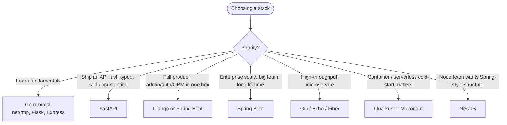

# 3. Why Use a Framework and How To?

> 🎬 **From the video:** _"A framework is a set of decisions made for you. The question is how many. Express — barely any. FastAPI — modern, async, auto docs. Django — batteries included. Spring Boot — the enterprise standard, opinionated, huge, and it scales to teams of hundreds."_
>
> This doc is the receipts for that 80 seconds — the actual code, the actual trade-offs, the actual docs to read next.

---

## TL;DR — start here if you're new

| If you're...                                | Start with                                    | Why                                                                            |
| ------------------------------------------- | --------------------------------------------- | ------------------------------------------------------------------------------ |
| 🟢 Brand new, just want to _get_ it         | **Express** (Node) or **Flask** (Python)      | Smallest surface area, closest to "raw HTTP," easiest to read every line       |
| 🟡 Building a real API for a real project   | **FastAPI** (Python) or **Gin** (Go)          | Modern defaults, great docs, not overwhelming                                  |
| 🔴 Joining a big team / enterprise codebase | **Spring Boot** (Java) or **Django** (Python) | This is what you'll meet on the job — worth knowing even if it's more to learn |

**🟢 = easy on-ramp, 🟡 = solid default, 🔴 = more to learn but industry-standard.** These badges repeat next to every framework below.

---

## 3.1 What a framework actually gives you

Every web framework is solving some subset of these problems, which you'd otherwise write yourself:

| Problem                              | Raw stdlib                               | Framework                                                |
| ------------------------------------ | ---------------------------------------- | -------------------------------------------------------- |
| Routing (`GET /users/:id`)           | Manual string/regex parsing              | Declarative router                                       |
| Parsing request bodies (JSON, forms) | Manual stream reading + parsing          | Built-in binding                                         |
| Input validation                     | Hand-rolled `if` checks                  | Schema/annotation-based validators                       |
| Middleware (auth, logging, CORS)     | Wrap every handler manually              | Composable middleware chain                              |
| Error handling                       | `try/catch` everywhere, ad hoc           | Centralized error handlers                               |
| Serialization (JSON out)             | Manual `json.Marshal`/`json.dumps` calls | Automatic content negotiation                            |
| Dependency injection / structure     | You invent your own convention           | Enforced or suggested project layout                     |
| Docs / OpenAPI                       | You write it by hand                     | Auto-generated from code (FastAPI, Spring, some Go libs) |
| Testing helpers                      | You build your own harness               | Built-in test clients                                    |

The trade-off is always the same shape:

```mermaid
graph LR
    A[No Framework] -->|+| B[Full control, zero magic,<br/>you understand every line]
    A -->|-| C[You rebuild routing, validation,<br/>middleware, errors — every project]
    D[Framework] -->|+| E[Batteries included,<br/>faster to ship, shared conventions]
    D -->|-| F[Learning curve, "magic",<br/>opinionated structure, version churn]
```

**Rule of thumb** (same one from the video):

- **Learning fundamentals / tiny services / maximum control** → go minimal (stdlib, or a micro-framework like Express or Gin).
- **Building something real that has to last, scale, and onboard other engineers** → go batteries-included (Spring Boot, Django, NestJS).

---

## 3.2 Node.js

Node's `http` module is already a working web server — frameworks here mostly add _ergonomics_, not capability.

### Raw Node (no framework)

```js
const http = require("node:http");
const { URL } = require("node:url");

const server = http.createServer((req, res) => {
  const url = new URL(req.url, `http://${req.headers.host}`);

  if (req.method === "GET" && url.pathname.startsWith("/users/")) {
    const id = url.pathname.split("/")[2];
    res.writeHead(200, { "Content-Type": "application/json" });
    res.end(JSON.stringify({ id, name: "Ada" }));
    return;
  }

  res.writeHead(404, { "Content-Type": "application/json" });
  res.end(JSON.stringify({ error: "not found" }));
});

server.listen(3000);
```

Notice: no path params, no body parsing, no middleware chain, no error boundary — you're building all of it, by hand, for every route.

### 🟢 Express — minimal, unopinionated

```js
import express from "express";
const app = express();
app.use(express.json());

app.get("/users/:id", (req, res) => {
  res.json({ id: req.params.id, name: "Ada" });
});

app.listen(3000);
```

- **What it buys you:** routing with params, JSON body parsing, a middleware pipeline (`app.use`), a huge third-party middleware ecosystem.
- **What it doesn't give you:** any opinion on project structure, DI, validation, or testing — you assemble those yourself or add libraries (Zod, express-validator, etc.).
- **Docs:** https://expressjs.com/

### 🟡 Fastify — Express's faster, schema-first sibling

```js
import Fastify from "fastify";
const app = Fastify();

app.get(
  "/users/:id",
  {
    schema: {
      params: { type: "object", properties: { id: { type: "string" } } },
    },
  },
  async (req) => {
    return { id: req.params.id, name: "Ada" };
  },
);

app.listen({ port: 3000 });
```

- **What it adds over Express:** JSON-schema validation and serialization built in (faster JSON output because it pre-compiles schemas), first-class async/await, a plugin encapsulation model that scales better in large codebases.
- **Docs:** https://fastify.dev/docs/latest/

### 🔴 NestJS — batteries-included, Angular-flavored

```ts
@Controller("users")
export class UsersController {
  @Get(":id")
  findOne(@Param("id") id: string) {
    return { id, name: "Ada" };
  }
}
```

- **What it adds:** TypeScript-first, decorators, dependency injection, modules, an opinionated architecture (controllers/services/modules) closer to Spring or Angular than to Express. Built on top of Express or Fastify under the hood.
- **When to reach for it:** large teams, long-lived codebases, when you want Spring-Boot-style structure in Node.
- **Docs:** https://docs.nestjs.com/

**Node summary**

| Framework       | Level | Philosophy                          | Best for                                 | Docs                             |
| --------------- | ----- | ----------------------------------- | ---------------------------------------- | -------------------------------- |
| `http` (stdlib) | —     | Zero abstraction                    | Learning, tiny scripts, custom protocols | https://nodejs.org/api/http.html |
| Express         | 🟢    | Minimal, unopinionated              | Small-to-mid APIs, full control          | https://expressjs.com/           |
| Fastify         | 🟡    | Minimal + schema validation + speed | High-throughput APIs                     | https://fastify.dev/             |
| NestJS          | 🔴    | Batteries-included, DI, structure   | Large teams, enterprise apps             | https://docs.nestjs.com/         |

---

## 3.3 Go

Go's standard library `net/http` is unusually capable already, which is why "just use the stdlib" is a genuinely common, respected choice in Go — more so than in any other language here.

### Raw Go (`net/http`, no framework)

```go
package main

import (
    "encoding/json"
    "net/http"
    "strings"
)

func usersHandler(w http.ResponseWriter, r *http.Request) {
    id := strings.TrimPrefix(r.URL.Path, "/users/")
    w.Header().Set("Content-Type", "application/json")
    json.NewEncoder(w).Encode(map[string]string{"id": id, "name": "Ada"})
}

func main() {
    mux := http.NewServeMux()
    mux.HandleFunc("/users/", usersHandler)
    http.ListenAndServe(":3000", mux)
}
```

Since Go 1.22, `http.ServeMux` even supports method + wildcard routing (`mux.HandleFunc("GET /users/{id}", ...)`), which closes a lot of the gap frameworks used to fill. **Docs:** https://pkg.go.dev/net/http

### 🟢 Gin — the default choice

```go
r := gin.Default()
r.GET("/users/:id", func(c *gin.Context) {
    c.JSON(200, gin.H{"id": c.Param("id"), "name": "Ada"})
})
r.Run(":3000")
```

- **What it adds over stdlib:** a fast trie-based router, request binding/validation (`c.ShouldBindJSON`), a large official + community middleware collection (`gin-contrib`), built-in logging/recovery middleware.
- **Why it's the default:** biggest community, most Stack Overflow answers, most third-party integrations — the safest choice if your team is new to Go.
- **Docs:** https://gin-gonic.com/en/docs/

### 🟡 Echo — cleaner API, more built-ins

```go
e := echo.New()
e.GET("/users/:id", func(c echo.Context) error {
    return c.JSON(200, map[string]string{"id": c.Param("id"), "name": "Ada"})
})
e.Start(":3000")
```

- **What it adds over Gin:** built-in data binding _and_ validation hooks, cleaner error-handling model (return `error` from handlers instead of writing directly), native HTTP/2 and WebSocket support.
- **Docs:** https://echo.labstack.com/

### 🟡 Fiber — Express-flavored speed

```go
app := fiber.New()
app.Get("/users/:id", func(c *fiber.Ctx) error {
    return c.JSON(fiber.Map{"id": c.Params("id"), "name": "Ada"})
})
app.Listen(":3000")
```

- **What it adds:** built on `fasthttp` instead of `net/http` for raw throughput, an API deliberately modeled on Express — easiest on-ramp for JS developers moving to Go.
- **Trade-off:** because it bypasses `net/http`, some stdlib-based middleware/tools won't plug in directly.
- **Docs:** https://docs.gofiber.io/

**Go summary**

| Option              | Level | Philosophy                           | Best for                                          | Docs                           |
| ------------------- | ----- | ------------------------------------ | ------------------------------------------------- | ------------------------------ |
| `net/http` (stdlib) | 🟢    | Genuinely production-viable alone    | Small services, minimal dependencies, learning Go | https://pkg.go.dev/net/http    |
| Gin                 | 🟢    | Fast, huge ecosystem                 | Default pick, first Go API                        | https://gin-gonic.com/en/docs/ |
| Echo                | 🟡    | Structured, feature-rich             | APIs needing validation/HTTP2 out of the box      | https://echo.labstack.com/     |
| Fiber               | 🟡    | Express-like, fastest raw throughput | JS devs moving to Go, latency-critical services   | https://docs.gofiber.io/       |

---

## 3.4 Python

Python spans the widest range here: from a raw socket server, to a minimal ASGI framework, to a full batteries-included one.

### Raw Python (`http.server`, no framework)

```python
from http.server import BaseHTTPRequestHandler, HTTPServer
import json

class Handler(BaseHTTPRequestHandler):
    def do_GET(self):
        if self.path.startswith('/users/'):
            user_id = self.path.split('/')[2]
            self.send_response(200)
            self.send_header('Content-Type', 'application/json')
            self.end_headers()
            self.wfile.write(json.dumps({'id': user_id, 'name': 'Ada'}).encode())
        else:
            self.send_response(404)
            self.end_headers()

HTTPServer(('', 3000), Handler).serve_forever()
```

Nobody ships this to production — it's single-threaded per request, has no routing, no validation, no async. It exists mainly to show the floor. **Docs:** https://docs.python.org/3/library/http.server.html

### 🟢 Flask — the "Express of Python"

```python
from flask import Flask

app = Flask(__name__)

@app.get("/users/<user_id>")
def get_user(user_id):
    return {"id": user_id, "name": "Ada"}
```

- **What it adds over raw Python:** routing, request/response objects, a WSGI dev server, extension ecosystem (Flask-SQLAlchemy, Flask-Login).
- **Where it sits:** minimal like Express — no built-in validation or async by default, you pick your own pieces.
- **Docs:** https://flask.palletsprojects.com/

### 🟡 FastAPI — modern, async, auto-documented

```python
from fastapi import FastAPI

app = FastAPI()

@app.get("/users/{user_id}")
async def get_user(user_id: str):
    return {"id": user_id, "name": "Ada"}
```

- **What it adds:** type-hint-driven request/response validation (via Pydantic), automatic interactive docs at `/docs` (Swagger UI) and `/redoc` generated from your type hints, native `async`/`await`, dependency injection for things like auth and DB sessions.
- **Best for:** APIs, ML/AI model-serving endpoints, microservices — anywhere you want speed of iteration _and_ strong typing.
- **Docs:** https://fastapi.tiangolo.com/

### 🔴 Django — batteries included

```python
# views.py
from django.http import JsonResponse

def get_user(request, user_id):
    return JsonResponse({"id": user_id, "name": "Ada"})

# urls.py
urlpatterns = [path("users/<str:user_id>/", get_user)]
```

- **What it adds:** an ORM, an admin panel generated from your models, authentication, a templating engine, forms, security-hardened defaults (CSRF, clickjacking protection), a migrations system — a full "product in a box."
- **Trade-off:** heavier, more opinionated about project layout, and if you only need a thin JSON API, Django REST Framework (built on top of Django) is usually what people actually reach for.
- **Docs:** https://docs.djangoproject.com/ · REST framework: https://www.django-rest-framework.org/

**Python summary**

| Framework              | Level | Philosophy                            | Best for                                       | Docs                                               |
| ---------------------- | ----- | ------------------------------------- | ---------------------------------------------- | -------------------------------------------------- |
| `http.server` (stdlib) | —     | Educational only                      | Understanding HTTP internals                   | https://docs.python.org/3/library/http.server.html |
| Flask                  | 🟢    | Minimal, unopinionated (like Express) | Small APIs, prototypes, full control           | https://flask.palletsprojects.com/                 |
| FastAPI                | 🟡    | Modern, async, typed, auto-docs       | APIs, ML services, microservices               | https://fastapi.tiangolo.com/                      |
| Django                 | 🔴    | Batteries included                    | Full products: admin, auth, ORM, CMS-like apps | https://docs.djangoproject.com/                    |

---

## 3.5 Java

Java's raw HTTP API is verbose enough that almost nobody builds production services without a framework. This isn't really "raw vs framework" like the other three languages — it's closer to "here's what frameworks are saving you from," then straight into framework-vs-framework.

<details>
<summary><b>Raw Java, if you're curious what frameworks are hiding from you (click to expand)</b></summary>

```java
import com.sun.net.httpserver.HttpServer;
import java.net.InetSocketAddress;

public class Main {
    public static void main(String[] args) throws Exception {
        HttpServer server = HttpServer.create(new InetSocketAddress(3000), 0);
        server.createContext("/users", exchange -> {
            String id = exchange.getRequestURI().getPath().split("/")[2];
            String body = "{\"id\":\"" + id + "\",\"name\":\"Ada\"}";
            exchange.getResponseHeaders().add("Content-Type", "application/json");
            exchange.sendResponseHeaders(200, body.length());
            exchange.getResponseBody().write(body.getBytes());
            exchange.getResponseBody().close();
        });
        server.start();
    }
}
```

Manual path parsing, manual byte writing, manual JSON — nobody does this in real projects. It's here purely so you can _see_ the floor. **Docs:** https://docs.oracle.com/en/java/javase/21/docs/api/jdk.httpserver/com/sun/net/httpserver/HttpServer.html

</details>

### 🔴 Spring Boot — the enterprise standard

```java
@RestController
@RequestMapping("/users")
public class UserController {

    @GetMapping("/{id}")
    public Map<String, String> getUser(@PathVariable String id) {
        return Map.of("id", id, "name", "Ada");
    }
}
```

- **What it adds:** dependency injection, auto-configuration (sensible defaults for everything from DB pools to security), an enormous ecosystem (Spring Data, Spring Security, Spring Cloud), embedded server (no separate app-server deploy step), actuator endpoints for health/metrics out of the box.
- **Why "the standard":** it's opinionated enough to keep a 200-engineer codebase consistent, but modular enough to swap pieces out. It's the framework most large companies default to for Java services — expect to meet it on the job even if you learn something else first.
- **Docs:** https://spring.io/projects/spring-boot · Guides: https://spring.io/guides

### 🟡 Quarkus — cloud-native, fast startup

```java
@Path("/users")
public class UserResource {

    @GET
    @Path("/{id}")
    public Map<String, String> getUser(@PathParam("id") String id) {
        return Map.of("id", id, "name", "Ada");
    }
}
```

- **What it adds over Spring Boot:** built for containers/Kubernetes/serverless — dramatically faster startup and lower memory via build-time (ahead-of-time) processing and GraalVM native-image support. Uses standard Jakarta REST (JAX-RS) annotations.
- **When to reach for it:** serverless functions, containers that need to cold-start fast, memory-constrained environments.
- **Docs:** https://quarkus.io/guides/

### 🟡 Micronaut — similar goals, DI at compile time

```java
@Controller("/users")
public class UserController {

    @Get("/{id}")
    public Map<String, String> getUser(String id) {
        return Map.of("id", id, "name", "Ada");
    }
}
```

- **What it adds:** compile-time dependency injection and AOP (no runtime reflection scanning), which — like Quarkus — means fast startup and low memory, good for microservices and serverless.
- **Docs:** https://docs.micronaut.io/

**Java summary**

| Framework          | Level | Philosophy                            | Best for                           | Docs                                                               |
| ------------------ | ----- | ------------------------------------- | ---------------------------------- | ------------------------------------------------------------------ |
| `HttpServer` (JDK) | —     | Educational / ultra-lightweight tools | Seeing what frameworks automate    | https://docs.oracle.com/en/java/javase/21/docs/api/jdk.httpserver/ |
| Spring Boot        | 🔴    | Batteries included, huge ecosystem    | Enterprise apps, teams of hundreds | https://spring.io/projects/spring-boot                             |
| Quarkus            | 🟡    | Cloud-native, fast cold start         | Kubernetes, serverless, containers | https://quarkus.io/guides/                                         |
| Micronaut          | 🟡    | Compile-time DI, fast cold start      | Microservices, serverless          | https://docs.micronaut.io/                                         |

---

## 3.6 Cross-language decision map



## 3.7 Same request, every stack — at a glance

| Language    | 🟢 Minimal / unopinionated | 🟡 Modern / balanced | 🔴 Batteries-included / enterprise |
| ----------- | -------------------------- | -------------------- | ---------------------------------- |
| **Node.js** | Express                    | Fastify              | NestJS                             |
| **Go**      | `net/http`                 | Gin / Echo           | Fiber (Express-style speed)        |
| **Python**  | Flask                      | FastAPI              | Django                             |
| **Java**    | _(no real minimal option)_ | Quarkus / Micronaut  | Spring Boot                        |

## 3.8 Recommended reading order

1. Build the raw/stdlib version in your language first (skip Java's — just read it) — it's the fastest way to understand what a framework is automating.
2. Read the framework's **"Getting Started" / Quickstart** page (linked above), not a random blog tutorial — the official quickstart is kept in sync with the current API.
3. Skim the framework's **routing** and **middleware** docs pages specifically — these two concepts map almost 1:1 across every framework in this doc, so once you understand one, you understand the shape of all of them.
4. Only reach for the batteries-included option (Django, Spring Boot, NestJS) once you've felt the pain the minimal option leaves unsolved — the opinions will make a lot more sense.

**Further official references**

- Node.js: https://nodejs.org/en/docs
- Go: https://go.dev/doc/
- Python: https://docs.python.org/3/
- Java: https://docs.oracle.com/en/java/
