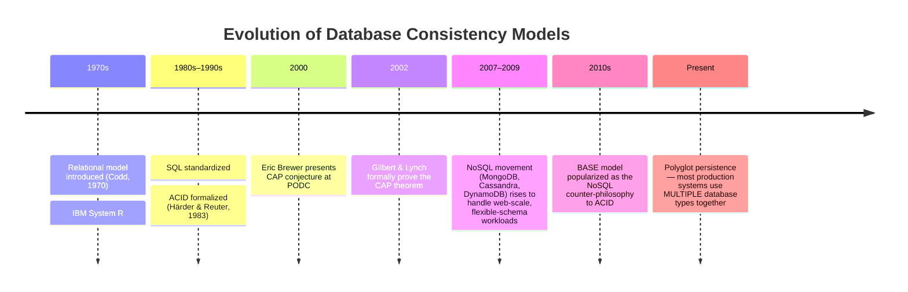
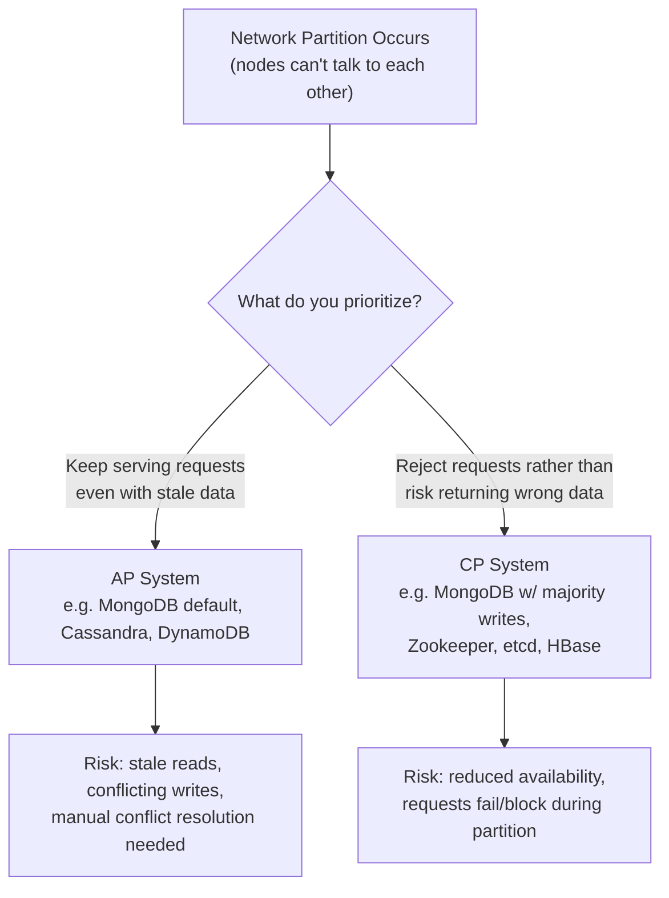
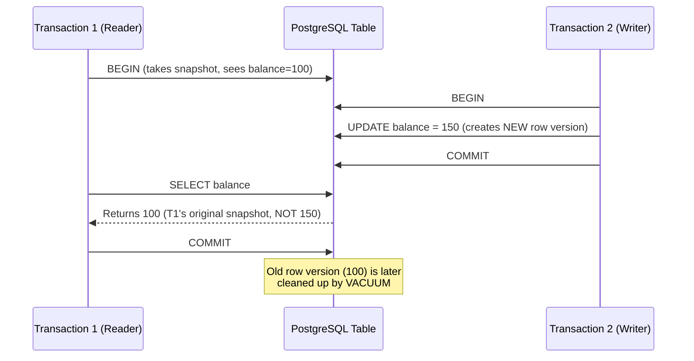
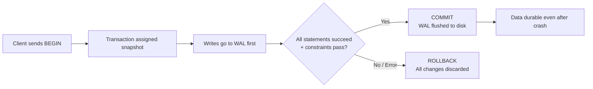
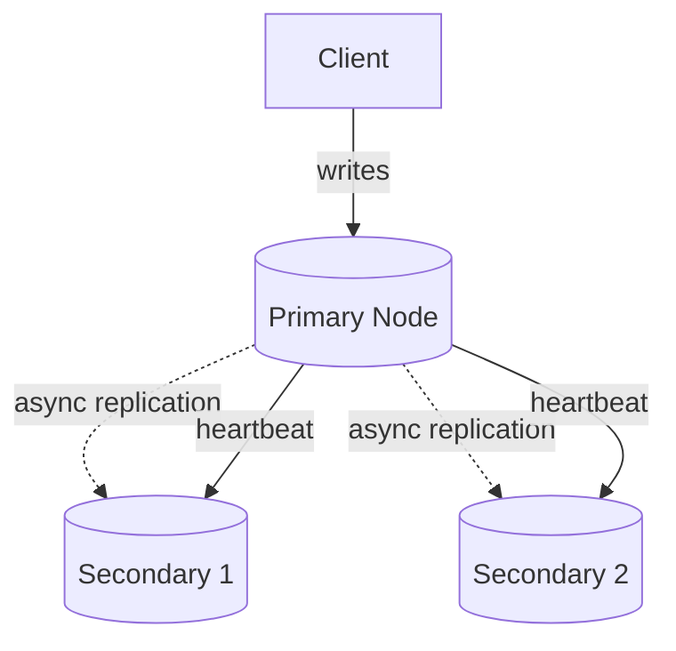
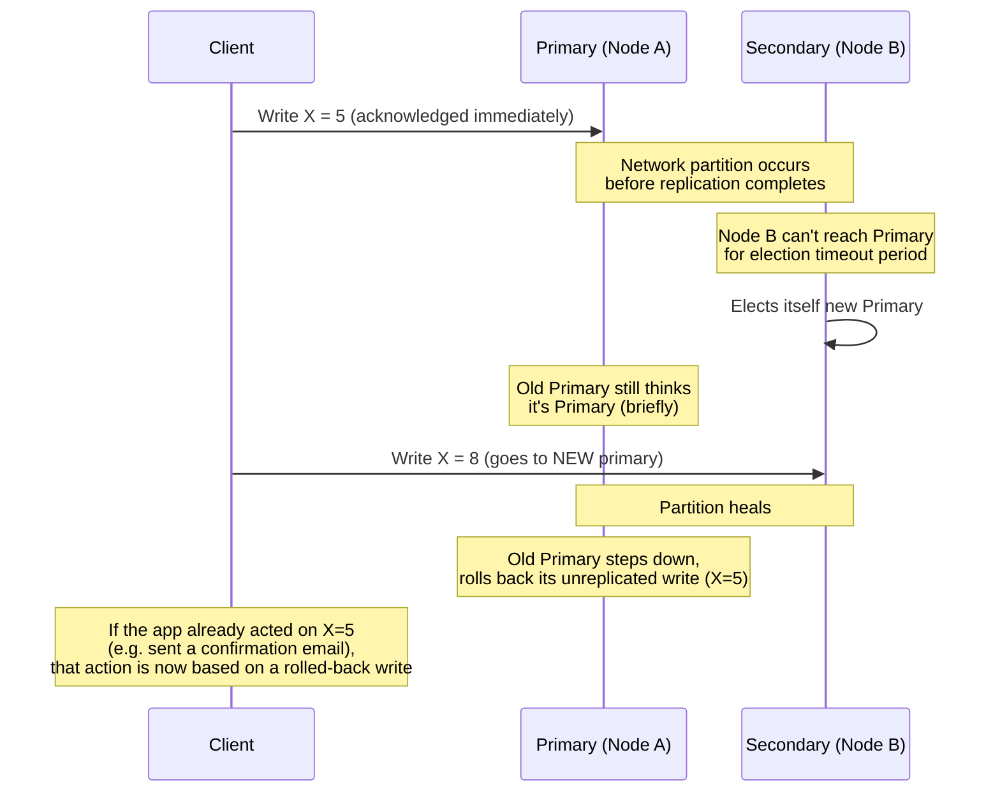
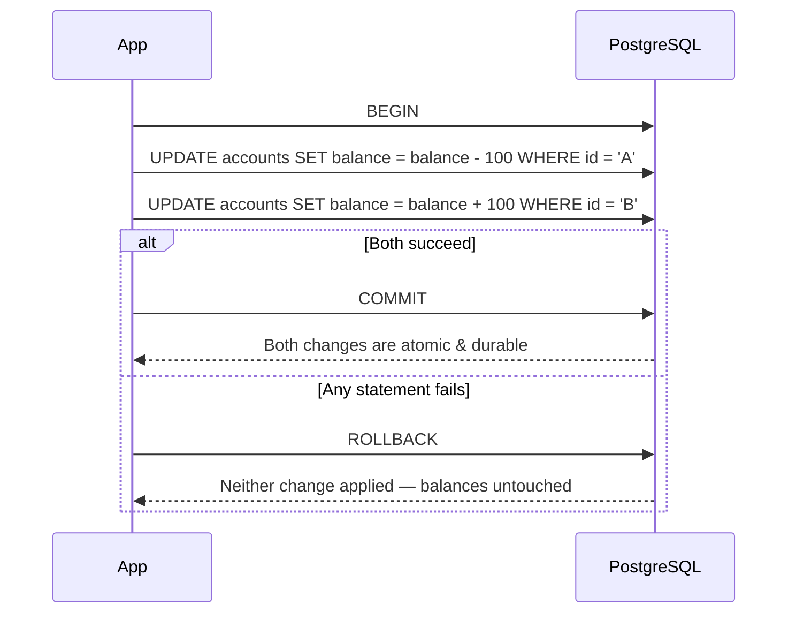
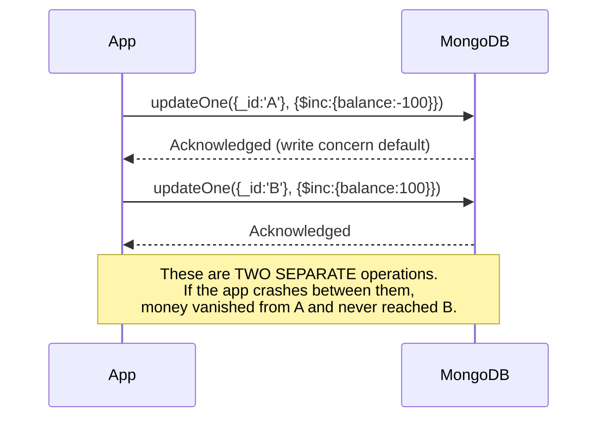
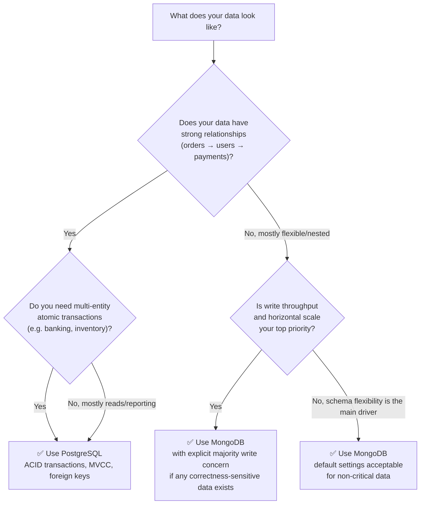
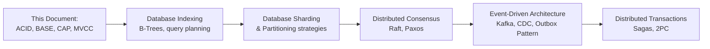

# Database Selection Architecture: ACID, BASE & the CAP Theorem

> A production engineering guide to choosing between relational (SQL) and document (NoSQL) databases — and understanding *why* the choice matters.

---

## 📌 Quick Summary

| | |
|---|---|
| **TL;DR** | Database choice is not a popularity contest. It is a trade-off decision between **consistency guarantees**, **availability**, and **data shape**. PostgreSQL (an RDBMS) gives you ACID transactions via MVCC. MongoDB (a document store) gives you horizontal scalability and flexible schema, at the cost of weaker default consistency guarantees. Picking the wrong one for your workload causes data corruption, race conditions, and outages that are extremely expensive to fix after launch. |
| **Difficulty** | 🟡 Intermediate |
| **Estimated Reading Time** | 35–45 minutes |
| **Prerequisites** | Basic SQL, basic understanding of what a database is, familiarity with client-server architecture |

### Learning Objectives

By the end of this document, you will be able to:

- [ ] Explain ACID and BASE consistency models and articulate the difference
- [ ] Explain the CAP theorem and correctly classify real databases against it
- [ ] Explain how PostgreSQL implements ACID internally via MVCC
- [ ] Explain how MongoDB replica sets achieve availability and where consistency is sacrificed
- [ ] Identify workload patterns that indicate "use relational" vs "use document store"
- [ ] Avoid the three most common database architecture mistakes in production systems
- [ ] Answer interview questions on ACID, BASE, CAP, and MVCC at junior→staff level

### Key Takeaways

- 🧠 There is no "best" database — only the right database for a given **workload shape** and **consistency requirement**.
- 🧠 MongoDB is not "worse" than PostgreSQL. It optimizes for a different point in the CAP triangle.
- 🧠 The CAP theorem only applies **during a network partition** — most of the time, both systems behave similarly.
- 🧠 "Eventual consistency" is not a bug — it's an explicit trade-off that must be a conscious architectural decision, not a default you fell into.

---

## Overview

### The Problem This Solves

Every backend system needs to answer one question honestly: **"What happens to my data when something goes wrong?"**

Something *will* go wrong — a server crashes mid-write, two requests update the same row simultaneously, a network partition splits your cluster in half. How your database behaves in that moment is determined by its **consistency model**, not by its marketing page.

Two dominant consistency philosophies exist:

| Model | Philosophy |
|---|---|
| **ACID** | "Never show incorrect data. Reject the operation if you can't guarantee correctness." |
| **BASE** | "Stay available and fast. Correctness will catch up eventually." |

Neither is universally correct. A payments ledger and a social media "like" counter have fundamentally different tolerance for temporary incorrectness.

### History & Evolution



### Modern Relevance

> [!IMPORTANT]
> In 2024–2025, most mature engineering orgs do **not** pick "one database for everything." They use **polyglot persistence**: PostgreSQL for the transactional core, Redis for caching, MongoDB/Elasticsearch for flexible or search-heavy data, and Kafka for event streams. The mistake isn't using MongoDB — the mistake is using it *everywhere*, including places that need strict transactional integrity.

---

## Mental Model

> [!TIP]
> **Analogy: A Bank Teller vs. A Whiteboard**
>
> - **ACID (PostgreSQL)** is like a **bank teller with a locked drawer**. Only one person can touch the money at a time. Every transaction is logged, verified, and either fully completes or is fully rejected. Slower, but nobody ever sees an impossible balance.
> - **BASE (MongoDB default)** is like a **shared office whiteboard with multiple locations synced by photo**. Anyone can write on their local copy immediately (fast, always available). Photos sync to other offices "eventually." For a second, two offices might show slightly different whiteboards. For tracking "how many people liked this post," that's fine. For tracking "how much money is in this account," that's a disaster.

### Visual: Where Each System Sits

```mermaid
quadrantChart
    title Consistency vs Availability Trade-off
    x-axis Low Availability --> High Availability
    y-axis Low Consistency --> High Consistency
    quadrant-1 CP Systems
    quadrant-2 Ideal (impossible during partition)
    quadrant-3 Neither (bad design)
    quadrant-4 AP Systems
    PostgreSQL (single node): [0.35, 0.9]
    MongoDB (default): [0.85, 0.55]
    Cassandra: [0.9, 0.3]
    Zookeeper/etcd: [0.3, 0.95]
```

---

## Core Concepts

### 1. ACID — Atomicity, Consistency, Isolation, Durability

> [!NOTE]
> ACID is a set of guarantees a database makes about **transactions** — groups of one or more operations that must succeed or fail as a single unit.

| Property | Meaning | Failure Without It |
|---|---|---|
| **Atomicity** | A transaction is all-or-nothing. If step 3 of 5 fails, steps 1–2 are rolled back. | Partial transfers — money leaves account A but never reaches account B. |
| **Consistency** | A transaction moves the database from one valid state to another, respecting all constraints (foreign keys, unique constraints, checks). | Orphaned rows, invalid foreign keys, negative balances. |
| **Isolation** | Concurrent transactions don't see each other's uncommitted intermediate state. | Two users overdraw the same account by reading stale balances simultaneously. |
| **Durability** | Once committed, data survives crashes, power loss, and restarts. | "Successful" writes silently vanish after a crash. |

<details>
<summary>📖 Formal definition (Härder & Reuter, 1983)</summary>

ACID was formally coined in the 1983 paper *"Principles of Transaction-Oriented Database Recovery"*. It was designed to answer one question: **how do you guarantee correctness when multiple operations touch shared data concurrently, and hardware can fail at any instant?**

</details>

### 2. BASE — Basically Available, Soft state, Eventual consistency

| Property | Meaning |
|---|---|
| **Basically Available** | The system guarantees a response (not necessarily the latest data), even during faults. |
| **Soft State** | The state of the system may change over time, even without new input, as replicas converge. |
| **Eventual Consistency** | If no new writes occur, all replicas will *eventually* converge to the same value — but there's no guaranteed time bound. |

> [!WARNING]
> "Eventually" is doing a lot of work in that sentence. It could be milliseconds. During a network partition, it could be minutes or longer. If your business logic assumes "eventually = instantly," you will ship a race-condition bug.

### 3. The CAP Theorem

Formalized by Gilbert & Lynch (2002), based on Eric Brewer's 2000 conjecture. It states:

> **A distributed data store can provide at most two of the following three guarantees simultaneously: Consistency, Availability, Partition Tolerance.**

| Letter | Guarantee | Definition |
|---|---|---|
| **C** | Consistency | Every read receives the most recent write or an error. |
| **A** | Availability | Every request receives a (non-error) response, without guarantee it's the latest data. |
| **P** | Partition Tolerance | The system continues to operate despite network failures between nodes. |

> [!IMPORTANT]
> In real, distributed production systems, **network partitions will happen.** This means Partition Tolerance is not optional — you must always choose it. The real decision CAP forces on you is: **when a partition occurs, do you sacrifice Consistency (choose AP) or Availability (choose CP)?**



### 4. MVCC — Multi-Version Concurrency Control

This is **how PostgreSQL achieves Isolation without locking every reader.**

> [!NOTE]
> Instead of locking rows for reads, PostgreSQL keeps **multiple versions** of a row. Each transaction sees a consistent "snapshot" of the database as of when it started, even if other transactions are writing concurrently.



**Why this matters:** readers never block writers, and writers never block readers. This is a major reason PostgreSQL handles high concurrency well for OLTP (Online Transaction Processing) workloads without sacrificing correctness.

---

## Internal Working

### How PostgreSQL Guarantees ACID

1. **Write-Ahead Log (WAL)** — every change is written to an append-only log *before* it's applied to actual data files. If the server crashes, PostgreSQL replays the WAL on restart → **Durability**.
2. **MVCC snapshots** — each transaction operates on a consistent view → **Isolation**.
3. **Constraint enforcement** — foreign keys, `CHECK`, `UNIQUE`, and `NOT NULL` constraints are validated before commit → **Consistency**.
4. **Two-Phase Commit-style commit protocol** — a transaction either fully applies or rolls back entirely → **Atomicity**.



### How MongoDB Replica Sets Achieve Availability

A MongoDB **replica set** consists of one **Primary** node (accepts writes) and multiple **Secondary** nodes (replicate asynchronously by default).



**The critical detail:** by default, a write is acknowledged as soon as the **Primary** accepts it — replication to Secondaries happens *after* the acknowledgment. This is what makes Mongo fast and highly available, and it's also the exact mechanism that creates the risk described below.

### The Split-Brain / Data Drift Scenario

> [!CAUTION]
> This is the scenario referenced in "Mistake #3." It is real, well-documented behavior — not a flaw unique to MongoDB, but a consequence of the AP design choice.



> [!TIP]
> **This is manageable.** MongoDB provides tunable consistency via **write concerns** (`w: "majority"`) and **read concerns** (`readConcern: "majority"`) that trade some availability/latency back for stronger consistency — effectively letting you dial MongoDB toward CP behavior for the specific operations that need it. The mistake isn't using MongoDB — it's using the *default* write concern for financial or multi-entity data.

---

## Step-by-Step Flow: A Transfer Operation in Both Systems

### PostgreSQL (Relational, ACID)



### MongoDB (Document Store, Default BASE)



> [!WARNING]
> MongoDB **does** support multi-document ACID transactions since version 4.0 (replica sets) and 4.2 (sharded clusters). The mistake described in the script is using MongoDB's **legacy single-document-only mental model** for genuinely multi-entity, transactional workloads — either by not using `session.withTransaction()` at all, or by not understanding its performance cost.

---

## Code Examples

### PostgreSQL: Production-Grade Transfer (Minimal → Production)

**❌ Bad Example — No transaction boundary**

```sql
-- DANGEROUS: two independent statements, no atomicity
UPDATE accounts SET balance = balance - 100 WHERE id = 'A';
UPDATE accounts SET balance = balance + 100 WHERE id = 'B';
```

If the connection drops between these two statements, money disappears. This looks like a transaction but isn't one.

**✅ Improved — Explicit transaction with isolation level**

```sql
BEGIN;

SET TRANSACTION ISOLATION LEVEL SERIALIZABLE;

UPDATE accounts
SET balance = balance - 100
WHERE id = 'A' AND balance >= 100;  -- guard against overdraft

UPDATE accounts
SET balance = balance + 100
WHERE id = 'B';

COMMIT;
```

**✅ Production Example — Node.js with `pg` and proper error handling**

```javascript
const { Pool } = require('pg');
const pool = new Pool();

async function transferFunds(fromId, toId, amount) {
  const client = await pool.connect();
  try {
    await client.query('BEGIN');

    const result = await client.query(
      `UPDATE accounts
       SET balance = balance - $1
       WHERE id = $2 AND balance >= $1
       RETURNING balance`,
      [amount, fromId]
    );

    if (result.rowCount === 0) {
      throw new Error('Insufficient funds or account not found');
    }

    await client.query(
      `UPDATE accounts SET balance = balance + $1 WHERE id = $2`,
      [amount, toId]
    );

    await client.query('COMMIT');
    return { success: true };
  } catch (err) {
    await client.query('ROLLBACK');
    throw err;
  } finally {
    client.release();
  }
}
```

**Key lines explained:**
- `BEGIN` / `COMMIT` / `ROLLBACK` — defines the atomic boundary.
- `WHERE id = $2 AND balance >= $1` — enforces the business constraint *inside* the same atomic operation, preventing a race where two concurrent transfers both pass a separate "check balance" step.
- `finally { client.release() }` — returns the connection to the pool regardless of outcome, preventing pool exhaustion.

---

### MongoDB: Production-Grade Transfer (Using Real Multi-Document Transactions)

**❌ Bad Example — Treating it like Postgres without transactions**

```javascript
// DANGEROUS: no atomicity, no session
await db.collection('accounts').updateOne(
  { _id: 'A' }, { $inc: { balance: -100 } }
);
await db.collection('accounts').updateOne(
  { _id: 'B' }, { $inc: { balance: 100 } }
);
```

**✅ Improved — Explicit multi-document transaction with a session**

```javascript
const session = client.startSession();

try {
  await session.withTransaction(async () => {
    const accounts = client.db('bank').collection('accounts');

    const from = await accounts.findOne(
      { _id: 'A', balance: { $gte: 100 } },
      { session }
    );

    if (!from) {
      throw new Error('Insufficient funds');
    }

    await accounts.updateOne(
      { _id: 'A' },
      { $inc: { balance: -100 } },
      { session }
    );

    await accounts.updateOne(
      { _id: 'B' },
      { $inc: { balance: 100 } },
      { session, writeConcern: { w: 'majority' } }
    );
  });
} finally {
  await session.endSession();
}
```

**Key lines explained:**
- `session.withTransaction()` — wraps operations in a real ACID transaction (available on replica sets/sharded clusters since MongoDB 4.0+).
- `writeConcern: { w: 'majority' }` — forces acknowledgment only after a **majority** of replica set members confirm the write, trading some latency for much stronger durability — directly mitigating the split-brain risk described earlier.
- Note the **performance cost**: multi-document transactions in MongoDB have overhead compared to native single-document atomic updates. This is a legitimate trade-off to evaluate, not a reason to avoid transactions entirely for financial data.

---

## Production Usage

| Concern | PostgreSQL Approach | MongoDB Approach |
|---|---|---|
| **Horizontal Scaling** | Read replicas + partitioning; sharding via extensions (Citus) or manual | Native sharding built-in |
| **Caching** | Redis in front of Postgres for hot reads | Often paired with Redis too, or relies on working-set-in-RAM |
| **Schema Evolution** | Migrations (Flyway, Liquibase, Prisma Migrate) — explicit, versioned | Schema-less by default; app-layer validation or `$jsonSchema` |
| **Containers/K8s** | StatefulSets with persistent volumes; managed via Postgres Operator | StatefulSets; managed via MongoDB Community/Enterprise Operator |
| **Managed Cloud** | AWS RDS/Aurora, GCP Cloud SQL, Azure Database for PostgreSQL | MongoDB Atlas, AWS DocumentDB (Mongo-compatible API) |
| **Observability** | `pg_stat_statements`, `EXPLAIN ANALYZE`, Postgres Exporter + Prometheus | MongoDB Atlas metrics, `explain()`, mongodb_exporter + Prometheus |

> [!TIP]
> **🚀 Production Insight:** Most large-scale systems (Uber, Instagram, Notion, Figma) run PostgreSQL as their **system of record** for core transactional data, and use MongoDB, Elasticsearch, or Redis as **derived/secondary stores** for search, caching, and flexible or high-write-throughput auxiliary data. This is polyglot persistence in practice.

---

## Performance

| Dimension | PostgreSQL | MongoDB |
|---|---|---|
| **Write throughput (single node)** | High, but bounded by WAL fsync and lock contention on hot rows | Very high — designed for write-heavy, high-ingest workloads |
| **Read latency under MVCC** | Very low — readers never block on writers | Low — but stale reads possible from secondaries |
| **Horizontal write scaling** | Requires sharding solutions (not native) | Native sharding designed in from the start |
| **Complex JOIN-heavy queries** | Excellent — query planner optimizes multi-table joins | Poor to moderate — `$lookup` aggregation exists but is not as optimized as relational joins |
| **Schema flexibility cost** | Migrations required for structural changes | No migration required, but inconsistent document shapes create query complexity later |

> [!NOTE]
> Neither database is "faster" in absolute terms — they are optimized for different access patterns. Benchmarks comparing them in isolation without matching workload shape are frequently misleading; always benchmark against **your actual query patterns**, not generic tests.

---

## Security

| Concern | PostgreSQL | MongoDB |
|---|---|---|
| **Authentication** | `pg_hba.conf`, SCRAM-SHA-256, role-based access | SCRAM-SHA-256, x.509 certs, LDAP (Enterprise) |
| **Authorization** | Fine-grained `GRANT`/`REVOKE` at table/column/row level (Row-Level Security) | Role-Based Access Control (RBAC) at database/collection level |
| **Injection Risk** | SQL Injection — mitigated via parameterized queries | NoSQL Injection — mitigated via input sanitization, avoiding raw `$where`/JS eval |
| **Encryption** | TLS in transit, TDE via extensions or disk-level encryption | TLS in transit, encrypted storage engine at rest |

> [!WARNING]
> **NoSQL injection is real and often underestimated.** Passing unsanitized user input directly into a MongoDB query object (e.g., `{ password: req.body.password }` where `req.body.password` is `{ "$ne": null }`) can bypass authentication logic entirely. Always validate types and use strict schema validation at the application layer.

---

## Best Practices

<details>
<summary><strong>PostgreSQL Best Practices</strong></summary>

- Use connection pooling (PgBouncer) — Postgres connections are relatively expensive.
- Always define foreign key constraints — don't enforce referential integrity only in application code.
- Use `EXPLAIN ANALYZE` before shipping any query touching a large table.
- Version-control schema migrations; never modify production schema manually.
- Set appropriate isolation levels per use case — don't default to `SERIALIZABLE` everywhere (it has a performance cost).

</details>

<details>
<summary><strong>MongoDB Best Practices</strong></summary>

- Design documents around **query patterns**, not around "how the data looks" — embed what you read together, reference what changes independently.
- Use `$jsonSchema` validation to prevent your "schema-less" database from becoming a "schema-chaos" database.
- Set `writeConcern: "majority"` explicitly for any operation where correctness matters more than raw latency.
- Use multi-document transactions deliberately and sparingly — they exist for a reason, but they're not free.
- Index deliberately — MongoDB will happily do full collection scans without warning you.

</details>

---

## Common Mistakes

### 🟢 Beginner Mistakes

| Mistake | Why It Happens | Correct Approach |
|---|---|---|
| Choosing MongoDB because "it's what the tutorial used" | Popularity ≠ suitability | Evaluate workload shape first: relational data with joins → SQL; flexible/nested/high-write data → document store |
| Using MongoDB's default write concern for financial data | Not knowing write concerns exist | Explicitly set `w: "majority"` for correctness-critical writes |
| Skipping foreign keys in Postgres "to move faster" | Feels like less friction short-term | Constraints catch bugs at write-time instead of silently corrupting data |

### 🟡 Intermediate Mistakes

| Mistake | Why It Happens | Correct Approach |
|---|---|---|
| Modeling MongoDB documents exactly like relational tables (heavy `$lookup` joins everywhere) | Relational thinking carried over unconsciously | Embed related data that's read together; this is the core NoSQL modeling skill |
| Assuming "eventual consistency" resolves in milliseconds | Undocumented assumption, not verified | Test under real partition/failover conditions; design UX to tolerate staleness explicitly |
| Ignoring `EXPLAIN ANALYZE` until production is slow | Query works fine on small dev dataset | Profile query plans against production-scale data before shipping |

### 🔴 Advanced Mistakes

| Mistake | Why It Happens | Correct Approach |
|---|---|---|
| Running MongoDB as CP without understanding the availability cost | Chasing "the strongest consistency" reflexively | Understand that `majority` write/read concerns reduce availability during partitions — a real trade-off, not a free upgrade |
| Using `SERIALIZABLE` isolation everywhere in Postgres "to be safe" | Overcorrecting for concurrency bugs | Use the weakest isolation level that satisfies correctness; `SERIALIZABLE` has real throughput cost under contention |
| No chaos/partition testing before going to production with a distributed data store | CAP trade-offs are invisible until a real partition occurs | Simulate network partitions in staging (e.g., Jepsen-style testing) before trusting a consistency model in production |

---

## Comparison: PostgreSQL vs. MongoDB

| Criteria | PostgreSQL | MongoDB |
|---|---|---|
| **Data Model** | Relational (tables, rows, foreign keys) | Document (BSON, nested/flexible) |
| **Default Consistency Model** | ACID | BASE (tunable toward stronger consistency) |
| **CAP Classification** | CP-leaning (single-node); consistency-first | AP-leaning by default; tunable toward CP |
| **Schema** | Fixed, enforced, migration-driven | Flexible, enforced only if you choose to |
| **Best For** | Complex relationships, financial data, multi-entity transactions, reporting/analytics with joins | High write throughput, nested/flexible data, rapid schema iteration, catalogs, content stores |
| **Worst For** | Extremely high write-throughput horizontal scaling out of the box | Deep relational joins, strict cross-entity transactional guarantees as a default behavior |
| **Learning Curve** | Moderate — SQL is a well-known, transferable skill | Low to start, moderate to master correct data modeling |
| **Community & Ecosystem** | Extremely mature; 25+ years of tooling | Mature; strong in JS/Node ecosystems |
| **Horizontal Write Scaling** | Requires extensions/manual sharding | Native |

---

## Decision Guide



> [!TIP]
> **"If your project needs..."**
> - **Banking, payments, inventory, multi-tenant SaaS billing** → PostgreSQL. Non-negotiable.
> - **Content management, catalogs, activity feeds, logging, IoT ingestion** → MongoDB is a strong fit.
> - **Both, in the same product** → This is normal and common. Use each where it's strong.

---

## Interview Preparation

<details>
<summary><strong>Junior Level</strong></summary>

**Q: What does ACID stand for and why does it matter?**
A: Atomicity, Consistency, Isolation, Durability. It matters because it guarantees a transaction either fully completes or has no effect at all, and that committed data survives crashes.

*What interviewers evaluate:* Basic vocabulary and whether you understand these aren't just buzzwords.

**Q: What's the difference between SQL and NoSQL databases?**
A: SQL databases use a fixed relational schema and enforce ACID guarantees; NoSQL databases (like document stores) use flexible schemas and often trade strict consistency for availability and horizontal scalability.

*What interviewers evaluate:* Whether you understand this is a trade-off, not a hierarchy.

</details>

<details>
<summary><strong>Mid Level</strong></summary>

**Q: Explain the CAP theorem and give an example of a CP vs AP system.**
A: In a distributed system, during a network partition you can only guarantee Consistency or Availability, not both. `etcd`/Zookeeper are CP (they'll refuse requests rather than risk inconsistency). MongoDB by default, and Cassandra, are AP (they stay available and reconcile later).

*What interviewers evaluate:* Whether you know CAP only applies **during a partition**, not all the time — a very common misunderstanding.

**Q: How does PostgreSQL achieve isolation without locking every read?**
A: MVCC — Multi-Version Concurrency Control. Each transaction reads a consistent snapshot of the database, so readers don't block writers and writers don't block readers.

*What interviewers evaluate:* Real internals knowledge vs. surface-level familiarity.

</details>

<details>
<summary><strong>Senior / Staff Level</strong></summary>

**Q: Design a data layer for a multi-tenant SaaS billing system. Justify your database choice(s).**
A: Core billing/invoice/payment data → PostgreSQL for ACID guarantees on money movement, with row-level security for tenant isolation. Usage analytics/event logs feeding billing calculations → could use a high-write store (e.g., Kafka → MongoDB/ClickHouse) since individual events tolerate eventual consistency, but the final invoice generation step must run inside an ACID transaction against Postgres.

*What interviewers evaluate:* Ability to combine multiple systems appropriately (polyglot persistence) rather than forcing one database to do everything, and correctly identifying which sub-problems are consistency-critical vs. tolerant of staleness.

**Q: Your MongoDB replica set just had a primary failover during a partition. What could have happened to recently acknowledged writes, and how would you prevent it?**
A: Writes acknowledged by the old primary before replicating to a majority of secondaries can be rolled back once the old primary rejoins as a secondary ("rollback"). Prevention: use `writeConcern: { w: "majority" }` so writes are only acknowledged after a majority of nodes have them, making them safe from rollback during failover.

*What interviewers evaluate:* Real production incident reasoning — this is a system design + reliability engineering question disguised as a database question.

</details>

---

## Hands-on Exercise

> [!NOTE]
> **Mini Project: Build a "Wallet Transfer" endpoint in both databases and break it on purpose.**

**Task:**

1. Spin up PostgreSQL and MongoDB locally via Docker.
2. Implement a `/transfer` endpoint in each that moves funds between two accounts.
3. In the **bad version**, remove the transaction wrapper (Postgres) or the session/transaction (Mongo).
4. Write a load test that fires 100 concurrent transfer requests between the same two accounts.
5. Observe: does either account go negative? Does the total sum across both accounts stay constant?

```bash
docker run --name pg-demo -e POSTGRES_PASSWORD=demo -p 5432:5432 -d postgres:16
docker run --name mongo-demo -p 27017:27017 -d mongo:7 --replSet rs0
```

**Expected Output (Correct Implementation):**

```text
Total balance before test: 1000
Total balance after 100 concurrent transfers: 1000
✅ Invariant held — no funds created or destroyed
```

**Extension Challenge:**
Introduce an artificial network partition (e.g., using `docker network disconnect`) mid-transfer on the MongoDB replica set. Observe replica set election behavior with `rs.status()`, and confirm whether an unacknowledged write survives or rolls back.

---

## Roadmap: What to Learn Next



| Topic | Why It's Next |
|---|---|
| **Indexing & Query Planning** | Understanding `EXPLAIN ANALYZE` is required before any of the above matters in practice. |
| **Sharding & Partitioning** | The natural next question once you understand CAP: how do you scale writes horizontally? |
| **Raft/Paxos Consensus** | How systems like etcd/Zookeeper actually achieve CP guarantees under the hood. |
| **Outbox Pattern / CDC** | How to safely bridge an ACID system (Postgres) with an eventually-consistent downstream (Kafka, search index) without losing events. |
| **Saga Pattern** | How to handle "transactions" that span multiple services/databases where a single ACID transaction isn't possible. |

---

## 📚 Learn More

**Official Documentation**
- [PostgreSQL: Transaction Isolation](https://www.postgresql.org/docs/current/transaction-iso.html)
- [PostgreSQL: MVCC](https://www.postgresql.org/docs/current/mvcc-intro.html)
- [MongoDB: Transactions](https://www.mongodb.com/docs/manual/core/transactions/)
- [MongoDB: Write Concern](https://www.mongodb.com/docs/manual/reference/write-concern/)
- [MongoDB: Replica Set Elections](https://www.mongodb.com/docs/manual/core/replica-set-elections/)

**Papers & Specifications**
- Gilbert, S. & Lynch, N. (2002). *"Brewer's Conjecture and the Feasibility of Consistent, Available, Partition-Tolerant Web Services"*
- Härder, T. & Reuter, A. (1983). *"Principles of Transaction-Oriented Database Recovery"*

**Related Topics to Explore**
- Two-Phase Commit (2PC) vs. the Saga Pattern
- Raft Consensus Algorithm
- Change Data Capture (CDC) and the Outbox Pattern
- Read Replicas vs. Sharding

---

> [!IMPORTANT]
> **Final principle to internalize:** The three "mistakes" in this space are never really about MongoDB or PostgreSQL as products. They're about **choosing a consistency model without deliberately evaluating whether it matches your workload's correctness requirements.** That evaluation is the actual engineering skill.