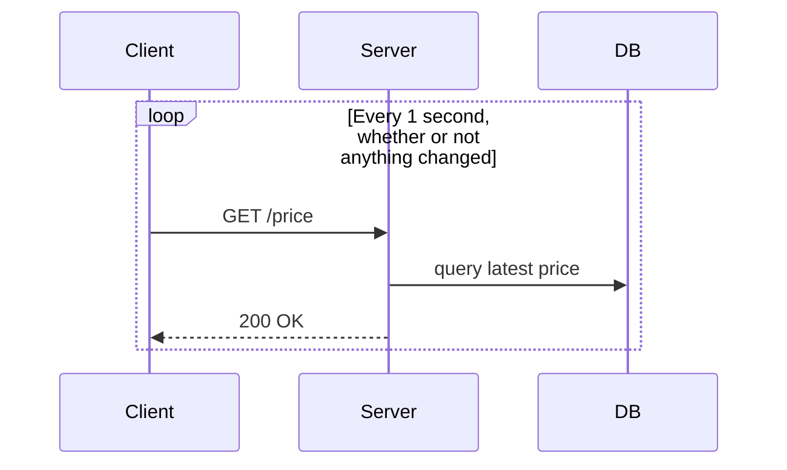
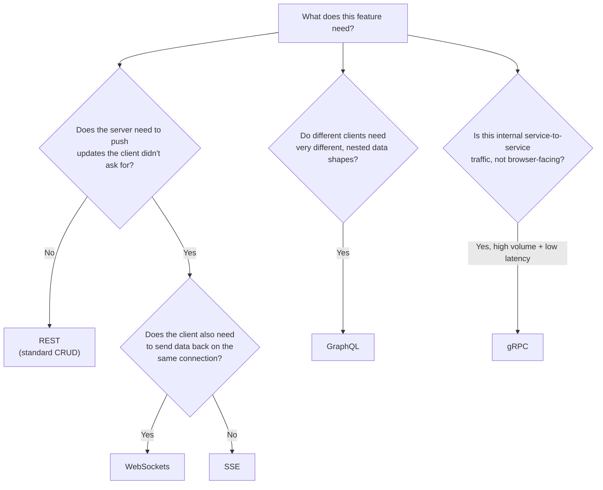
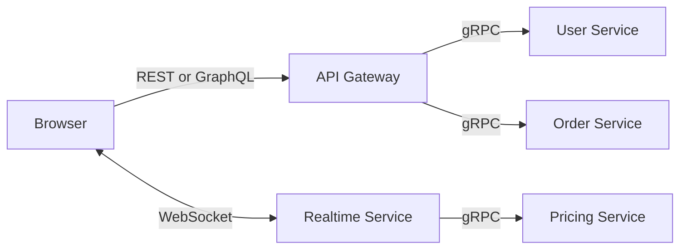

# Choosing a Client-Server Communication Protocol

> REST, WebSockets, SSE, GraphQL, and gRPC solve different problems. This guide explains what each one is actually for, so you stop reaching for REST by default and start reaching for the right tool.

**Reading time:** ~15 minutes · **Level:** Intermediate · **Prerequisites:** Basic HTTP and JSON

---

## The Core Mistake

The most expensive API design mistake isn't picking the "wrong" protocol — it's picking REST for a job it was never designed to do, and then papering over the gap with **polling**: calling a REST endpoint on a fixed timer to fake real-time updates.



Polling load scales with **clients × poll frequency**, not with how often data actually changes. 50 clients polling once a second is 3,000 database reads a minute — even if the price moved twice. This is the failure mode that breaks backends: not "REST is bad," but "REST was asked to do a job it isn't built for."

As a rule of thumb: **if you're polling an HTTP endpoint more than once a second, that's a signal to switch to a push-based protocol** — not to poll faster.

---

## The Five Tools, at a Glance

|                     | REST            | WebSockets                                           | SSE                                                      | GraphQL                                      | gRPC                              |
| ------------------- | --------------- | ---------------------------------------------------- | -------------------------------------------------------- | -------------------------------------------- | --------------------------------- |
| **Direction**       | Client → Server | Full duplex                                          | Server → Client only                                     | Client → Server                              | Full duplex (streaming)           |
| **Transport**       | HTTP            | HTTP upgrade → TCP                                   | Plain HTTP                                               | HTTP (usually POST)                          | HTTP/2                            |
| **Payload**         | JSON            | Any (JSON, binary)                                   | Text stream                                              | JSON                                         | Protobuf (binary)                 |
| **Browser support** | Universal       | 99%+                                                 | ~97%                                                     | Universal (via `fetch`)                      | Needs a proxy (gRPC-Web)          |
| **Complexity**      | Low             | Medium                                               | Low                                                      | Medium–High                                  | High                              |
| **Best for**        | Standard CRUD   | Bidirectional real-time (chat, trading, multiplayer) | One-way live feeds (scores, notifications, AI streaming) | Multi-client apps with different data shapes | Internal service-to-service calls |

> [!TIP]
> These aren't five competing answers to the same question — they're answers to five _different_ questions. A single production system typically uses three or four of them at once, each for the part of the problem it fits.

---

## REST: The Default, and Why It Has Limits

REST is an architectural style — not a protocol — defined by Roy Fielding's 2000 dissertation on top of standard HTTP: stateless requests, resource-based URLs, and standard verbs (`GET`, `POST`, `PUT`, `DELETE`).

It's the right default because it's cacheable, universally supported, and simple to debug. Its limit is structural, not a flaw: **the server can never speak first.** Every update requires the client to ask. That's fine for a user profile page. It's the wrong shape for a live trading chart.

```http
GET /users/123 HTTP/1.1
Host: api.example.com
Authorization: Bearer <token>
```

```json
{
  "id": "123",
  "name": "Asha Verma",
  "email": "asha@example.com"
}
```

---

## WebSockets: When Both Sides Need to Talk

A WebSocket starts as a normal HTTP request with an `Upgrade: websocket` header, then switches to a persistent, full-duplex TCP connection. After that handshake, either side can send a message at any time, with far less overhead than a fresh HTTP request per message.

This is the actual fix for the trading-chart problem — push data only when it changes, to every connected client, over one open connection:

```javascript
// Server: push only on real change — not on a timer
priceFeed.on("update", (newPrice) => {
  if (newPrice === lastPrice) return;
  lastPrice = newPrice;
  wss.clients.forEach((client) => {
    if (client.readyState === WebSocket.OPEN) {
      client.send(JSON.stringify({ price: newPrice }));
    }
  });
});
```

```javascript
// Client
const socket = new WebSocket("wss://api.example.com/prices");
socket.onmessage = (e) => updateChart(JSON.parse(e.data).price);
```

Reconnection is the part beginners skip. WebSockets don't retry themselves — production code needs explicit backoff-and-reconnect logic, plus heartbeat pings to detect dead connections before the OS notices.

> [!WARNING]
> WebSockets are **stateful** — the server must hold every open connection in memory. Scaling to multiple server instances requires a shared layer (commonly Redis pub/sub) so a message published on one instance reaches clients connected to another.

---

## SSE: When Only the Server Needs to Talk

Server-Sent Events push data from server to client over a single long-lived HTTP connection — no protocol upgrade, no special infrastructure. The browser's native `EventSource` API handles reconnection automatically, resuming via `Last-Event-ID`.

```javascript
// Server
res.set({ "Content-Type": "text/event-stream", Connection: "keep-alive" });
scoreEmitter.on("update", (score) =>
  res.write(`data: ${JSON.stringify(score)}\n\n`),
);
req.on("close", () => scoreEmitter.off("update", listener)); // avoid leaking listeners
```

```javascript
// Client
const events = new EventSource("/stream/scores");
events.onmessage = (e) => renderScoreTicker(JSON.parse(e.data));
```

SSE is the simpler choice whenever the client only needs to _receive_ — live scores, notification feeds, or token-by-token AI response streaming. It rides on plain HTTP, which also means it survives corporate proxies and firewalls that sometimes block WebSocket upgrades. The one hard limit: it's strictly one-directional. The moment the client needs to send data back on the same channel, that's a WebSockets problem, not an SSE one.

---

## GraphQL: When Different Clients Need Different Shapes

REST ties the response shape to the endpoint. If your mobile app needs less data than your web app, REST either over-fetches (sends fields nobody asked for) or under-fetches (forces multiple round trips to assemble one screen).

GraphQL inverts this: the client sends a single query describing exactly the fields it wants, and the server resolves exactly that shape from one endpoint.

```graphql
query {
  user(id: "123") {
    name
    posts(limit: 5) {
      title
    }
  }
}
```

One request replaces what would be two or three separate REST calls, and the response contains nothing the client didn't ask for. The cost is real, though: a flexible schema means an unbounded query can force the server to resolve an enormous, deeply nested amount of data. Production GraphQL servers need query depth and complexity limits — not just request-rate limiting — or a single malicious query becomes a denial-of-service vector.

---

## gRPC: When Services Talk to Services, Not Browsers

gRPC is Google's RPC framework, running over HTTP/2 with Protocol Buffers — a compact binary format — instead of JSON. A shared `.proto` file defines the contract; both sides generate strongly-typed client and server code from it, so a field-name typo becomes a compile error instead of a runtime bug.

```protobuf
service UserService {
  rpc GetUser (GetUserRequest) returns (UserResponse);
}
message GetUserRequest { string user_id = 1; }
message UserResponse { string id = 1; string name = 2; }
```

The client calls this like a local function; gRPC handles serialization and the network call underneath. Binary payloads and HTTP/2 multiplexing make it fast and bandwidth-efficient — but it isn't browser-native (needs gRPC-Web plus a proxy) and it isn't human-readable on the wire, which makes ad-hoc debugging harder than REST/JSON. This is why it lives almost exclusively **behind** the API gateway, between internal services, not in front of it facing the browser.

---

## Decision Guide



A realistic architecture layers these together rather than picking one winner:



---

## Common Mistakes

| Mistake                                                           | Fix                                                                                           |
| ----------------------------------------------------------------- | --------------------------------------------------------------------------------------------- |
| Polling a REST endpoint every second to fake real-time            | Push-based protocol: SSE if one-way, WebSockets if bidirectional                              |
| Modeling a GraphQL schema 1:1 with database tables                | Design the schema around how clients actually query, not the schema of your DB                |
| No reconnection logic on WebSocket clients                        | Connections _will_ drop (mobile networks, LB timeouts) — implement backoff + retry explicitly |
| Exposing an unbounded public GraphQL API                          | Add query depth/complexity limits before launch, not after an incident                        |
| Reusing or renumbering Protobuf field tags                        | Never reuse/renumber — Protobuf's wire format depends on field numbers, not names             |
| Scaling WebSockets across multiple instances with no shared state | Add a pub/sub backplane (e.g. Redis) so broadcasts reach clients on any instance              |

---

## Interview Notes

**"Why is polling considered an anti-pattern for real-time features?"**
Because its cost scales with client count × poll frequency, not with how often the underlying data actually changes — it wastes both server and client resources to simulate something a push-based protocol does natively.

**"When would you choose SSE over WebSockets?"**
When the data only flows server → client. SSE is simpler to run (plain HTTP, no upgrade handshake) and reconnects automatically; reach for WebSockets only once the client genuinely needs to send data back on the same channel.

**"How would you scale a WebSocket service horizontally?"**
Each instance only knows about the connections it's holding, so broadcasting requires a shared layer — commonly Redis pub/sub — to fan a message out to clients connected on other instances.

**"Should internal microservices talk over WebSockets or gRPC?"**
Different jobs: gRPC gives strongly-typed, low-overhead RPC well-suited to service-to-service calls behind a load balancer; WebSockets are for pushing updates to end-user clients. Most production systems use gRPC internally and WebSockets (or SSE) at the edge.

---

## Learn More

- [WebSocket.org — Protocol Comparisons](https://websocket.org/comparisons/) — decision matrix and use-case breakdowns across WebSockets, SSE, MQTT, WebRTC, and gRPC
- [MDN — Using WebSockets](https://developer.mozilla.org/en-US/docs/Web/API/WebSockets_API)
- [MDN — Server-Sent Events](https://developer.mozilla.org/en-US/docs/Web/API/Server-sent_events)
- [GraphQL — Official Docs](https://graphql.org/learn/)
- [gRPC — Official Docs](https://grpc.io/docs/)
- [RFC 6455 — The WebSocket Protocol](https://www.rfc-editor.org/rfc/rfc6455)
- Roy Fielding (2000), _Architectural Styles and the Design of Network-based Software Architectures_ — the dissertation that defined REST

---

> [!IMPORTANT]
> The recurring question isn't "which protocol is best" — it's "what direction does this data need to flow, how often, and who's on the other end (a browser or another service)?" Answer that first, and the choice stops being a guess.
